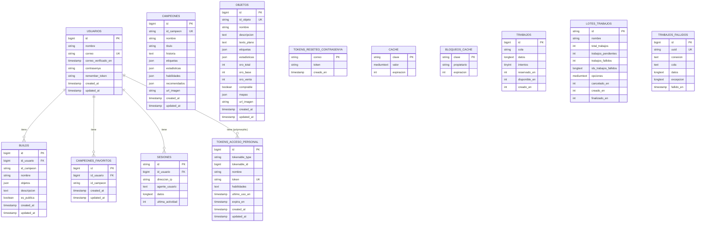

# Diagrama Entidad-Relación - Base de Datos LoL.GG

## Diagrama ER en formato Mermaid

## Descripción de las Relaciones

### Relaciones Principales

1. **USUARIOS → BUILDS** (1:N)
   - Un usuario puede tener múltiples builds
   - Relación con `onDelete('cascade')` - si se elimina un usuario, se eliminan sus builds

2. **USUARIOS → CAMPEONES_FAVORITOS** (1:N)
   - Un usuario puede tener múltiples campeones favoritos
   - Restricción única: un usuario no puede tener el mismo campeón favorito dos veces
   - Relación con `onDelete('cascade')`

3. **USUARIOS → SESIONES** (1:N, opcional)
   - Un usuario puede tener múltiples sesiones activas
   - La relación es opcional (nullable) - las sesiones pueden existir sin usuario

4. **USUARIOS → TOKENS_ACCESO_PERSONAL** (1:N, polymorphic)
   - Un usuario puede tener múltiples tokens de autenticación (Sanctum)
   - Relación polymorphic (puede asociarse a diferentes modelos)

### Tablas Independientes

- **CAMPEONES**: Tabla independiente que almacena información de campeones desde Data Dragon
- **OBJETOS**: Tabla independiente que almacena información de objetos desde Data Dragon
- **TOKENS_RESETEO_CONTRASENYA**: Tabla independiente para tokens de reseteo de contraseña
- **CACHE** y **BLOQUEOS_CACHE**: Tablas del sistema de cache de Laravel
- **TRABAJOS**, **LOTES_TRABAJOS**, **TRABAJOS_FALLIDOS**: Tablas del sistema de cola de trabajos de Laravel

### Notas Importantes

1. **id_campeon** en `builds` y `campeones_favoritos` es una referencia al ID de Data Dragon (string), no una clave foránea directa a la tabla `campeones`. Esto permite flexibilidad para trabajar con campeones que aún no están sincronizados en la base de datos local.

2. **objetos** en `builds` es un campo JSON que almacena un array de IDs de objetos, permitiendo múltiples objetos por build sin necesidad de una tabla intermedia.

3. **TOKENS_ACCESO_PERSONAL** usa una relación polymorphic, lo que significa que puede asociarse con diferentes modelos (principalmente `User` en este caso). Las columnas `tokenable_type` y `tokenable_id` mantienen los nombres estándar de Laravel para compatibilidad con Sanctum.

4. Todas las tablas principales tienen `timestamps` (created_at, updated_at) excepto las tablas del sistema como cache y trabajos que usan campos personalizados.

5. **Nomenclatura en Español**: Todas las tablas, columnas y relaciones están en español, siguiendo la convención de usar "ny" en lugar de "ñ" cuando sea necesario para compatibilidad con sistemas que no soportan caracteres especiales.

## Uso del Diagrama

Este diagrama puede visualizarse en:
- GitHub (renderiza Mermaid automáticamente)
- Visual Studio Code (con extensión Mermaid)
- Editores online como https://mermaid.live/
- Documentación Markdown que soporte Mermaid

